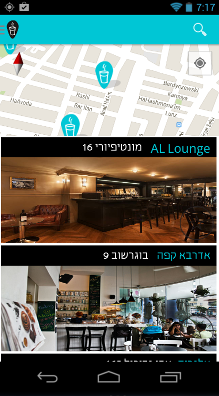

I wanted to create a nice search box with autocomplete results dropdown in the ActionBar. I could have used the `SearchView` widget but I didn't want to create a *searchable activity* and all the necessary overhead. Instead I used a more lightweight approach with [AutoCompleteTextView](http://developer.android.com/reference/android/widget/AutoCompleteTextView.html). I'll explain here the steps needed to be done in order to make it work.

My model app was the Gmail app which looks like this :

## Creating the layouts

First, lets create the required layouts. Here's the layout for the search box :

And here is the layout for a single drop down entry : (You can design the layout as you want)

## Adding an adapter

Now, we need to create an adapter to bridge between our data and the list view that drops down from the search box. In my case, it's a `ArrayAdapter` of `JSONObject`s. The data that I want to display on the dropdown consists of *venue name* and *venue address* but obviously it can be anything that you want. 

It's important that our adapter will also be [`Filterable`](http://developer.android.com/reference/android/widget/Filterable.html) so the `AutoCompleteTextView` could call the `getFilter()` method to filter the list. 

Here's the adapter class :

As you can see we override two methods, the `getView()` method which is standard for any adapter. It gets called each time the adapter needs to populate another row in the view.  
We also override `getFilter()` to return a filter that will take care of narrowing the list each time the user enters another character in the search box.  
Here is the custom filter class we are using :

## Taking care of the action bar

Now, we want to put the AutoCompleteTextView inside the ActionBar. For backwards compatibility, I am using [ActionBarCompat](http://android-developers.blogspot.co.il/2013/08/actionbarcompat-and-io-2013-app-source.html) but you can ActionBarSherlock or no backwards compatibility package at all. Actionbar supports a custom view that you can put in it. We are going to use it to put the AutoCompleteTextView in the action bar.

So by now we should have all the core functionality working.  
There are some more stuff left to do. I'd like the action bar to not show the edit text box all the time and instead appear only when I click on the *magnifier* icon (just like with the `SearchView`).

## Creating a clearable AutoCompleteTextView
First, we're gonna have to create a mechanism for the user to close the search box. Something like this :

 `AutoCompleteTextView` doesn't come with a dismiss button so lets extend it and add the necessary code.

You can see that there's a default `OnClearListener` that just clears the text. We're not going to use it. Instead, we will set a custom clear listener that will toggle between the visibility of the search box and the search icon.

Lets change `MainActivity` to use the new text view : 

We replaced `AutoCompleteTextView` with our new custom `ClearableAutoCompleteTextView`. We've also added listeners to handle clicks on the search icon and clicks on the clear button.

Showing and hiding the search box requires a set of operations to be performed like showing and hiding the keyboard and requesting focus on the text view. This is all done in 'toggleSearch' method.

## Summary

The code is pretty straightforward, using well known and frequently used concepts from Android framework like list adapters, custom views etc.

The end result looks something like this :
### closed search box

### opened search box

### opened search box with autocomplete results

