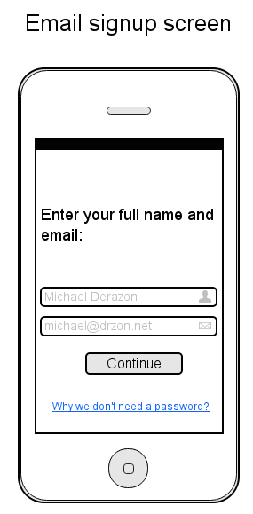
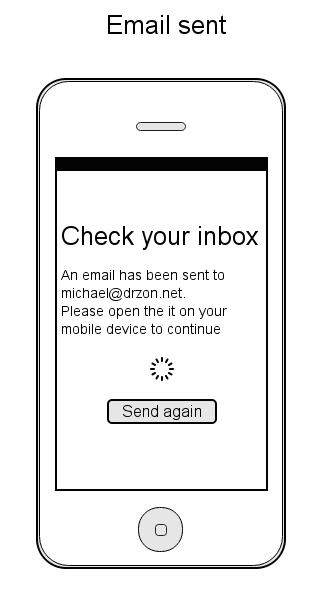

This post touches some problems with traditional email logins in mobile apps and suggests a different approach to handle login without requiring the user to enter any password.

The post is not very technical. Other than occasionally mentioning "client / server" it doesn't talk about any specific framework / language. Instead, it tries to explain the overall flow and behaviour of passwordless login in mobile apps.

I might add some additional framework specific code examples later but for now it's mostly ideas.

## Traditional login
Our app has always had an option to sign up with a social account - Facebook and Google+.   
We started with social sign up because we thought it would make the log in process easy for the user. We quickly found out that people don't like logging in with their social accounts, I think it's due to bad reputation of apps posting all kind of junk on behalf of the user. The situation has changed since and most of the login providers have given a lot of privacy control back to the users but the bad rep is still there.

**I was mostly tired of the worn out email sign up flow which usually consists of the following separate requirements**:

1. Show a page with input field for email and password. Since the password is masked, need to either add another "validate password" input field or give the users an option to unmask the password to make sure they got it right.
2. If you want to make sure the email address is real (not all apps need this step), you need to send a verification email to the user.
3. Need to build a "forgot my password" flow.
4. Need to enforce some kind of password policy, so people won't put `1234` or `password` as their password (optional, but recommended).

This is **quite an overhead** for just letting people use your app.

## Passwordless login
I was looking for a simpler solution when I came across a [nice blog post](https://hacks.mozilla.org/2014/10/passwordless-authentication-secure-simple-and-fast-to-deploy/) by Mozilla engineers. The idea is this:  
Why let people create crappy and insecure passwords to access your service when you can leverage other services that they have like gmail / outlook that already have a secure authentication system, probably better than what you can afford to build. The added value is that they won't need to remember a new password.

I took the idea in the blog and added a little twist to adjust it to mobile apps

### How does it work ?
Think of it as taking the "Reset password" flow and making it the main flow to authenticate. In an nutshell:

1. User enters an email address
2. An email with a one time token link is sent to the user.
3. User clicks the link in the mail
4. User is authenticated.

Lets walk through the flow step by step

#### Step 1. Get the user's email address


Notice the absence of a password field.

Since it's a little bit unorthodox I've included a short link explaining why we don't need a password.

What happens behind the scenes here ?
- After hitting "Continue", a call to the server is made with the name and the email address of the user. 
- The server creates a one time token, saves it in some persistent storage (db / Redis etc). It's also a good practice to give an expiration to the token (one hour sounds like a good enough time).
- It then sends an email to the user with an activation link

After the email is sent, the call returns to the app saying and the user is presented with the following screen:



#### Step 2. User gets an email
User gets the email we sent on step 1 and opens it.

The mail can say anything you like but it should have a clear call to action, like this button.


The "Open app" button contains a *deeplink* to the app with the token itself. Something like
``` html
<a href="myapp://login?token=...">Open app</a>
```

You can learn about deeplinking on [Wikipedia](https://en.wikipedia.org/wiki/Mobile_deep_linking). Basically, almost all mobile platforms (Android / iOS included) let you link into your app from other apps by simply opening "deep links". Intercepting and acting on these deep links is different on each platform and is out of the scope of this post.  

##### One important comment about this step:
Some email providers, Gmail most notably, don't let you put links with non standard url schemes (like `myapp://`) in html anchor `<a>` elements.

One easy way of circumventing this is to use the server as a proxy that redirects to the actual deep link url:  
just create the following endpoint on the server:
``` 
GET /login
```
Then the link can point there:
``` html
<a href="https://api.myserver.com/login?token=...">Open app</a>
```
Which results in a `3xx` redirect from the server to `myapp://login?token=...`

For really short second the user's mobile browser is opened but immediately after that the app opens up.


#### Step 3. User clicked the link in the email
So, let's assume the user opened your app from the deep link and you extracted the token from that link url param.

##### What should I do with the token ?

Once you have a token, you use it to call the server and authenticate the user. On the server side you need to check that the token is valid and that it hadn't been used before and perhaps check that it's not expired.

#### Step 4. User is authenticated
At this point you validated the token and all looks well, it's a good time to create a session for the user for future calls so that the user won't have to authenticate again.

You can use any method for handling sessions like cookies / headers etc. 


## Conclusion

From a user flow perspective, this method is much more smooth. Let's look at what we've achieved:

1. User only needs to put an email address in the sign up page. To make it even easier, we can pre-fill that email field for the user by extracting it from the device.
2. User doesn't need to think of / remember a password for yet another service.
3. In mobile apps, with deep linking, the process can't get any easier for the user - put email address --> open mail --> click the activation link --> authenticated.
4. We leveraged a 3rd party service like Gmail to do the authentication for us and thus making it more secure as we don't need to store any hashed passwords in the backend.


If you want to check out how it works in a real app, download CUPS - Unlimited Coffee for [Android](https://play.google.com/store/apps/details?id=com.citylifeapps.cups&hl=en) / [iOS](https://itunes.apple.com/us/app/cups-unlimited-coffee/id556462755?mt=8) (shameless plug :)  

